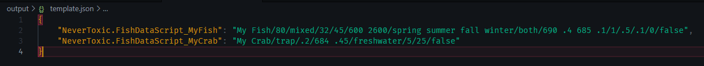

# Fish Data Converter

Allows you to work with field names instead of the slash delimited values the game expects.

This converter turns the following:


into this:




## Prerequisites

- [python 3.12](https://www.python.org/downloads/)

## How to Use

- Create a `.json` file in the input folder and add in all the fish you want to add using the format specified below.
- Run the `main.py` file through your command prompt.

More information about the various fish field can be found on the [stardew wiki](https://stardewvalleywiki.com/Modding:Fish_data). I've copied some of the field explanations from there as well.

### ModId

ModId is recommended to be set (as per naming guidelines), you could however leave it out if you don't use it.
To use your ModId in one of the fish's IDs, add `{{ModId}}` to it.
```jsonc
{
    // The mod's unique ID
    // Should be the same as `ModId` in your `manifest.json`
    "ModId": "NeverToxic.FishDataScript"
}
```

### Custom Fish

```jsonc
{
    // The fish's unique ID
    // {{ModId}} will be converted to the ModId specified above, if specified
    "{{ModId}}_MyFishUniqueId": {

        // The fish's name, what the game will call it
        "Name": "My Fish",

        // How often the fish darts in the fishing minigame
        // Expects an integer
        "ChanceToDart": 80,

        // The bobber's behaviour in the fishing minigame
        // Expects one of the following: mixed, smooth, floater, sinker, dart
        "DartingRandomness": "mixed",

        // The minimum and maximum size of the fish
        // Expects a dictionary with the keys "Min" and "Max"
        "Size": {
            "Min": 32, // Expects an integer
            "Max": 45 // Expects an integer
        },

        // The time of day the fish spawns
        // Expects a list of ranges with the keys "Min" and "Max"
        // Min is inclusive while Max is exclusive
        "TimeRanges": [
            {
                "Min": 600, // Expects an integer
                "Max": 2600 // Expects an integer
            }
            // You can add more time ranges here
        ],

        // The weather during which the fish can be caught
        // Expects one of the following values: sunny, rainy, both
        "Weather": "both",

        // The minimum water depth to cast to for maximizing the chance of catching a type of fish
        // Expects an integer
        "MaxDepth": 1,

        // The spawn multiplier used in the spawn rate calculation
        // Expects a floating point value
        "SpawnMultiplier": 0.5,

        // The depth multiplier used in the spawn rate calculation
        // Expects a floating point value
        "DepthMultiplier": 0.1,

        // The minimum fishing level required for the fish to appear
        // Expects an integer
        "FishingLevel": 0,

        // Whether the fish can be caught for the first tutorial catch
        // Expects a boolean (true or false)
        "TutorialCatch": true
    }
    // Add more fish here
}
```

### Custom Crabpot Fish

```jsonc
{
    // The fish's unique ID
    // {{ModId}} will be converted to the ModId specified above, if specified
    "{{ModId}}_MyCrab": {

        // The fish's name, what the game will call it
        "Name": "My Crab",

        // The percentage chance that this fish will be caught as a value between 0 and 1
        // Expects a floating point value
        "Chance": 0.2,

        // The type of water the fish can be caught in
        // Expects one of the following values: freshwater, ocean
        "WaterType": "freshwater",

        // The minimum and maximum size of the fish
        // Expects a dictionary with the keys "Min" and "Max"
        "Size": {
            "Min": 5, // Expects an integer
            "Max": 25 // Expects an integer
        }
    }
    // Add more fish here
}
```

## Bug Reports

Please open an issue or send a pull request if you find a bug.

## Licensing

Copyright © 2024 Dunc4nNT

This project is licensed under the Mozilla Public License 2.0 (MPL 2.0). See [LICENSE](./LICENSE) for more information.
